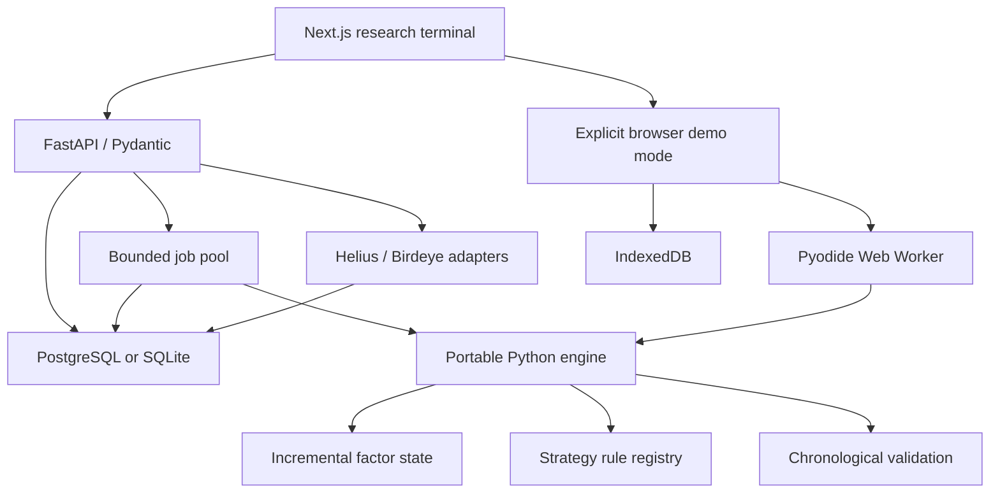

# Architecture

The repository is a small monorepo. There is one API and one worker pool, not a fleet of microservices.

## Module boundaries

| Module | Responsibility |
|---|---|
| `backend/app/domain.py` | Validated portable strategy configuration; unsupported fields rejected |
| `providers/` | HTTP retry policy, provider-specific retrieval and normalization |
| `quality.py` | Completeness gates; price/liquidity coverage; duplicate and invalid data checks |
| `factors.py` | FIFO wallet evidence, rolling unique buyers/volume, liquidity, age and momentum |
| `strategies.py` | Allowed strategy registry and `should_enter` rule protocol |
| `engine.py` | Chronological event loop, pending orders, cash, positions, execution and split boundaries |
| `metrics.py` | Returns, drawdown, daily Sharpe, win rate and undefined-metric handling |
| `models.py`, `repository.py` | SQLAlchemy persistence and immutable normalized datasets |
| `jobs.py`, `ingestion.py` | Asynchronous work and persisted job state |
| `reports.py` | Reproducible Markdown report, independent of UI |
| `frontend/lib/api.ts` | Explicit API/browser mode boundary and local persistence |
| `frontend/public/research-worker.js` | Fixed commands into the shared Python code; no arbitrary user code |

## Persistence

- `datasets`: metadata, provenance, quality assessment, content hash and kind.
- `events`: normalized payloads with dataset/event identity uniqueness and a timeline index.
- `strategies`: named research projects, dataset binding and current configuration.
- `backtests`: immutable configuration snapshots, state/progress, errors and complete result JSON.
- `trades`: separately persisted closed trades, indexed by run and segment.
- `reports`: idempotently generated Markdown report per completed run.
- `ingestions`: request, progress, dataset summary and raw provider transaction snapshots.

Alembic migration `0001` declares the schema explicitly. API startup does not run `create_all`. SQLite uses WAL and foreign keys; PostgreSQL uses psycopg. Datasets cannot be overwritten through the API. Create a new dataset identity when changing observations.

## Execution and deployment

FastAPI returns `202` immediately and the bounded `ThreadPoolExecutor` executes jobs outside the request handler. Ordinary requests continue; a regression test holds a research worker while querying health/datasets. CPU work is still subject to Python's GIL. This is a single-process MVP, not a distributed durable queue. Interrupted jobs are marked failed on restart and can be rerun. Queue limits are best-effort single-host limits, not an adversarial admission-control guarantee.

Docker Compose starts PostgreSQL, the API and Next.js. The private hosted preview is a separate explicit static deployment: Python in WebAssembly, synthetic-only data, IndexedDB persistence. It does not pretend that PostgreSQL or real-data ingestion is hosted there. The native/WASM parity test checks matching inputs, fingerprints and outputs.

## Extension points

Add a factor to `FACTOR_REGISTRY`, implement its incremental state using only observed events, and extend the typed configuration/API controls. Add a strategy rule to `STRATEGY_REGISTRY` and the allowed `strategy_type` validator; no execution-loop rewrite is required for a new entry rule using the same long-only position lifecycle. Strategies requiring shorting, limit orders or leverage need explicit execution-model extensions.

Implement `HistoricalMarketProvider.fetch` for a new market provider. Its normalized observations must include actual historical timestamps, USD price and historical liquidity, with availability rules and missingness preserved. Never convert transfers to swaps based solely on opposite token movements.
